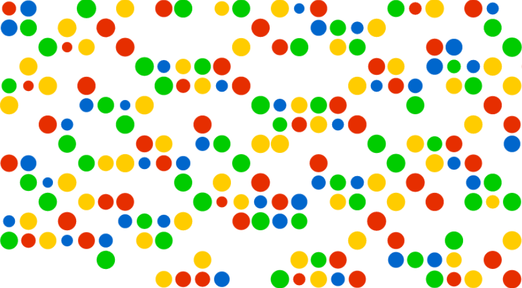

###Radius Death - a JavaScript game engine.



This is a JavaScript game engine I've called Radius Death. It's 100% vanilla JavaScript.

The engine allows for a hybrid system where players' units move in turn, but the game is ongoing, so it's like a slowed-down RTS game, or a turn based game that doesn't wait for the player to think.

Right now, the engine generates boards based on map states saved in text files with ```load_doc()```

It generates player objects, which each have an array of units. The players oppose one another.

Player order is determined at the start of the game. All players are put in an array of players and shuffled (to make it random).

Units prioritise attacking enemies over moving. The decisions made by each unit are handled in ```take_turn()```

If there's an enemy in the next horizontal/vertical space, the unit attacks. Otherwise, the unit moves towards the enemy. The unit cannot move through any units, including friendlies, or walls, see ```check_square_vacancy()```

Units can break down walls to get to their closest enemies.

####Getting distances between units

This is achieved with Pythagus' Theorum. Each unit has x and y coords. So if a unit is not directly horizontal or vertical from an opposing unit, that unit finds the hypotenuse as the distance.

If the opposing unit is horizontal or vertical, then that is the distance.
For several enemies of the same distance, a unit will choose one at random. 

####Game ideas

A strategy game where you control just a few units. Each of those has abilities and power up options. You can build fortifications etc. The game will have a spawn generator and your enemies will just keep coming at you.

A survival game with a set number of enemies, who can't see you until you're in range or in sight. It would be a zombie-type survival game, where you need to find objects, etc. The player would keep objects they find between levels, but the level would end when they get to certain points. I like this idea the most.

A game that shows how bacteria become resistant to antibiotics. The player would have a button for giving a dose, but then only some of the bacteria would die. The survivors would give the resistances to their offspring.

####Examples of illustrating RTS principles - 
These are a few principles that are common to all real time strategy and turn based strategy combat games.

For two equally-matched units, the unit that moves last before fighting has a disadvantage. When the fighting starts, the opponent who was there first will be able to attack first. This is the same in real time fighting as resting and preparing before engagement, and is usually the defender's advantage.

- http://www.jason-thomas.xyz/static/projects/radius_death_engine/?one_vs_one

Two equal units (with the same environmental constants) that face only each other will have completely predictable results. But, when there're more units, the results of a game become less predictable. This is especially the case with this game engine since units target enemies of a similar distance away randomly.

- http://www.jason-thomas.xyz/static/projects/radius_death_engine/?one_vs_all

Units of the same colour will naturally form groups (and survive longer by doing so). 

- http://www.jason-thomas.xyz/static/projects/radius_death_engine/?form_groups

A force can defeat a significantly larger one if opposing units can be isolated and attacked one at a time.

- http://www.jason-thomas.xyz/static/projects/radius_death_engine/?one_by_one

It is almost always better to allow your opponents to fight each other, rather than have to fight them, assuming their is no benefit for attacking enemies. Survival is often best achieved by being away from the battle (this game engine does not support resources, which would dramatically change things).

- http://www.jason-thomas.xyz/static/projects/radius_death_engine/?let_others_fight

Units boardering areas with no enemies will, on average, be less open to attacks. They will also be less effective at holding important areas (again, no resources available yet).

- http://www.jason-thomas.xyz/static/projects/radius_death_engine/?group_advantage
- http://www.jason-thomas.xyz/static/projects/radius_death_engine/?spiral

Killing units that are almost dead is an optimal strategy, especially if those units don't suffer a disadvantage for being hurt. The fewer enemy units that can hurt your units, the better.

####Some other examples 
- http://www.jason-thomas.xyz/static/projects/radius_death_engine/?chess_board
- http://www.jason-thomas.xyz/static/projects/radius_death_engine/?obstacles
- http://www.jason-thomas.xyz/static/projects/radius_death_engine/?packed_in
- http://www.jason-thomas.xyz/static/projects/radius_death_engine/?simple_map_large_obstacles
- http://www.jason-thomas.xyz/static/projects/radius_death_engine/?simple_map_large_no_obstacles